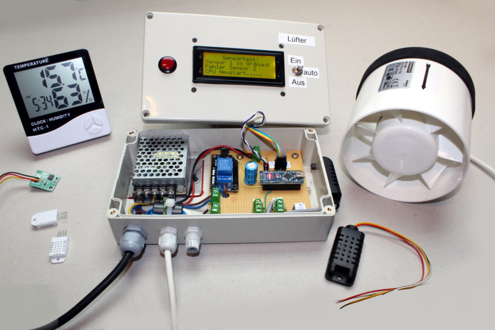

Maker Media GmbH

***

# Taupunktlüfter

**Lüften ist die beste und billigste Maßnahme gegen feuchte Keller  – jedenfalls, wenn man es richtig macht und sich nicht von außen zusätzliche Nässe ins Gewölbe holt. Bei unserem Projekt behält ein Arduino Nano die aktuellen Taupunkte drinnen und draußen rund um die Uhr im Auge und legt durch gezieltes Lüften den Keller trocken.**

Hier gibt es den Arduino-Code zum Projekt des Taupunktlüfters sowie den gegenüber dem Heft um den Modusschalter erweiterten Schaltplan:

Der Modusschalter ist ein Schalter mit drei Schaltstellungen: links, Mitte, rechts. In der Mittelstellung sind alle Pole frei, bei rechts wird der mittlere Pol nach rechts verbunden und bei links der mittlere Pol nach links. Beschaltet wird dann beispielsweise so: linker Kontakt des Schalters auf GND (linke Stellung ist dann für **aus**), rechter Kontakt auf VCC (5V, rechte Stellung ist dann für **an**) und Mittelkontakt auf Arduino-IO-Pin 6 (Verbindung zum Relais, Mittelstellung ist dann für **Automatik**).

Den vollständigen Artikel gibt es in der **[Make-Ausgabe 1/22 ab Seite 22](https://www.heise.de/select/make/2022/1/2135511212557842576)** zu lesen.
